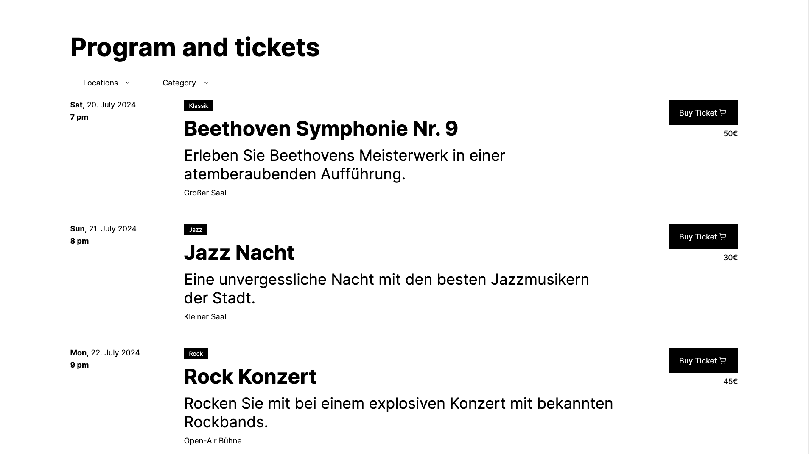

# MIR MEDIA - Frontend Assessment Task

A event listing application built using Nuxt.js 3 and Vue 3 Composition API. The application allows users to browse and filter a list of events, providing a user-friendly and intuitive interface for discovering and managing events. Demo hosted at [Github Pages](https://barantoro.github.io/mir/)

## Table of contents

-   [Overview](#overview)
    -   [The challenge](#the-challenge)
    -   [Screenshot](#screenshot)
-   [Getting Started](#getting-started)
    -   [Setup](#setup)
    -   [Development Server](#development-server)
    -   [Production](#production)
-   [Components](#components)
    -   [CustomSelectbox](#custom-selectbox)
    -   [EventFilter](#event-filter)
    -   [EventList](#event-list)
-   [Store](#store)
-   [Accessibility](#accessibility)
-   [Unit Testing](#testing)

## Overview

### The Challenge

#### Main Page

-   **Event List Display:** The main page will display a list of events retrieved from the provided JSON file.
-   **Dynamic Filtering:** Implement dynamic filters to allow users to filter events by category and location.
-   **Responsive Design:** Ensure the page layout is responsive, providing an optimal viewing experience on different screen sizes.
-   **Clear Documentation:** Provide clear and concise documentation of your code for ease of understanding and maintenance.

#### Stack Requirement

-   Nuxt 3
-   Vuex or Pinia for state management
-   TypeScript (optional)
-   SASS (optional)

#### Bonus Tasks

-   Include WCAG 2 accessibility standards.
-   Write tests.

### Screenshot

<p align="center">
  
</p>

## Getting Started

To get started with the project, follow the instructions below:

### Installation

Clone the repository:

```bash
git clone https://github.com/barantoro/mir
cd mir
```

### Setup

Make sure to install the dependencies:

```bash
# npm
npm install

# yarn
yarn install
```

### Development Server

Start the development server on `http://localhost:3000`:

```bash
# npm
npm run dev

# yarn
yarn dev

```

### Production

Build the application for production:

```bash
# npm
npm run build

# yarn
yarn build
```

Locally preview production build:

```bash
# npm
npm run preview

# yarn
yarn preview
```

Check out the [deployment documentation](https://nuxt.com/docs/getting-started/deployment) for more information.

## Components

### Custom Selectbox

The `CustomSelectbox` component is a dropdown menu for selecting options. It supports keyboard navigation and includes ARIA attributes for accessibility.

### Props

| Prop         | Type   | Default              | Description                                                              |
| ------------ | ------ | -------------------- | ------------------------------------------------------------------------ |
| `options`    | Array  | `[]`                 | An array of items to populate the select options. This prop is required. |
| `modelValue` | String | `''`                 | The currently selected value. This is used for two-way data binding.     |
| `label`      | String | `'Select an option'` | The placeholder text displayed when no option is selected.               |

### Events

| Event               | Description                                    |
| ------------------- | ---------------------------------------------- |
| `update:modelValue` | Event emitted when the selected option changes |

### Example Usage

```vue
<template>
	<custom-selectbox label="Locations" :options="locations" v-model="location" aria-labelledby="location-select" />
</template>

<script setup>
import { ref } from "vue";
import CustomSelectbox from "./CustomSelectbox.vue";

const locations = ref(["Location 1", "Location 2"]);
</script>
```

### Event Filter

The `EventFilter` component provides a user interface for filtering events based on location and category using the `CustomSelectbox` component.

### Props

| Prop         | Type  | Default | Description                                 |
| ------------ | ----- | ------- | ------------------------------------------- |
| `categories` | Array | `[]`    | An array of category options for filtering. |
| `locations`  | Array | `[]`    | An array of location options for filtering. |

### Events

| Event    | Description                                                                                                       |
| -------- | ----------------------------------------------------------------------------------------------------------------- |
| `filter` | Emitted when the selected category or location changes. Contains an object with category and location properties. |

### Example Usage

```vue
<template>
	<event-filter :categories="categories" :locations="locations" @filter="applyFilter" />
</template>

<script setup>
import { ref } from "vue";
import EventFilter from "./EventFilter.vue";

const categories = ref(["Music", "Sports", "Theatre"]);
const locations = ref(["New York", "Los Angeles", "Chicago"]);

const applyFilter = (filter) => {
	console.log("Filters applied:", filter);
};
</script>
```

### Event List

The `EventList` component displays a list of events. If no events are available, it shows a friendly message encouraging users to check back later or adjust their filters.

### Props

| Prop     | Type  | Default | Description                           |
| -------- | ----- | ------- | ------------------------------------- |
| `events` | Array | `[]`    | An array of event objects to display. |

### Events

| Event    | Description                                                                                                       |
| -------- | ----------------------------------------------------------------------------------------------------------------- |
| `filter` | Emitted when the selected category or location changes. Contains an object with category and location properties. |

### Example Usage

```vue
<template>
	<event-list :events="events" />
</template>

<script setup>
import { ref } from "vue";
import EventList from "./EventList.vue";

const events = ref([
	{
		id: 1,
		date: "2024-07-20",
		time: "19:00",
		category: "Music",
		title: "Concert in the Park",
		description: "An outdoor concert featuring local bands.",
		location: "Central Park",
		price: 20,
	},
	{
		id: 2,
		date: "2024-07-21",
		time: "20:00",
		category: "Theatre",
		title: "Shakespeare in the Park",
		description: "A live performance of Hamlet.",
		location: "Central Park",
		price: 15,
	},
]);
</script>
```

## Store

This `Pinia` store manages the state for events, categories, and locations, and provides an action to fetch event data.

### State

| State        | Type  | Description        |
| ------------ | ----- | ------------------ |
| `events`     | Array | Event objects.     |
| `categories` | Array | Unique categories. |
| `locations`  | Array | Unique locations.  |

### Actions

| Event         | Description                                                                                                   |
| ------------- | ------------------------------------------------------------------------------------------------------------- |
| `fetchEvents` | Fetches event data from an external source, populates `events`, and extracts unique categories and locations. |

### Example Usage

```vue
<template>
	<div>
		<EventList :categories="eventStore.categories" :locations="eventStore.locations" @filter="handleFilter" />
		<EventFilter :events="eventStore.events" />
	</div>
</template>

<script setup>
import { onMounted } from "vue";
import { useEventStore } from "./stores/eventStore";

const eventStore = useEventStore();

onMounted(() => {
	eventStore.fetchEvents();
});
</script>
```

## Accessibility

The application is designed to meet the Web Content Accessibility Guidelines (WCAG 2) standards, ensuring that all users can access and use the application with ease. This includes:

-   ARIA roles and properties to convey the role and state of interactive elements
-   High contrast colors and clear typography
-   Keyboard navigation to allow users to interact with the dropdown using the keyboard
-   Focus management
-   Dynamic aria-labels to provide context-sensitive information
-   Semantic HTML elements to enhance the understanding of the page structure for assistive technologies.

## Testing

Unit testing with Vitest:

```bash
# npm
npm run test

# yarn
yarn test
```
